# Mailgeko

<p align="center">
  <strong>Self-hostable email marketing — audiences, campaigns, automation and analytics in one deployable unit.</strong><br/>
  Frontend · Go API · async worker · TiDB/MySQL · Redis · Postgres+pgvector · Resend · Stripe
</p>

<p align="center">
  
  
  
  
</p>

> **The whole platform ships as one Docker image.** The Next.js web app, the Go
> API and the async worker run side by side in a single container, backed by
> MySQL/MariaDB, Redis and Postgres — so it's as easy to run on your laptop as it
> is on a production VPS.

---

## Table of contents

- [1. What is Mailgeko?](#1-what-is-mailgeko)
- [2. Feature overview](#2-feature-overview)
- [3. System architecture](#3-system-architecture)
- [4. Data model](#4-data-model)
- [5. Core flows (how it works)](#5-core-flows-how-it-works)
  - [5.1 Account lifecycle](#51-account-lifecycle)
  - [5.2 Authentication & security](#52-authentication--security)
  - [5.3 Contacts, lists & segments](#53-contacts-lists--segments)
  - [5.4 Campaign lifecycle](#54-campaign-lifecycle)
  - [5.5 Email rendering & tracking](#55-email-rendering--tracking)
  - [5.6 Delivery events & webhooks](#56-delivery-events--webhooks)
  - [5.7 Analytics pipeline](#57-analytics-pipeline)
  - [5.8 AI studio](#58-ai-studio)
  - [5.9 Billing & sending limits](#59-billing--sending-limits)
- [6. Technology stack](#6-technology-stack)
- [7. Repository layout](#7-repository-layout)
- [8. HTTP API reference](#8-http-api-reference)
- [9. Getting started](#9-getting-started)
- [10. Environment variables](#10-environment-variables)
- [11. Deployment](#11-deployment)
- [12. Security model](#12-security-model)
- [13. Testing](#13-testing)
- [14. Known limitations & roadmap](#14-known-limitations--roadmap)
- [15. License](#15-license)

---

## 1. What is Mailgeko?

Mailgeko is a complete, self-hostable **email marketing platform**. You can:

- import and manage **contacts** (CSV, tags, custom fields, dedupe),
- organize them into **lists** and dynamic **segments**,
- design reusable **templates** with contact placeholders,
- build and **schedule campaigns** with per-recipient rendering and
  **open/click/unsubscribe tracking**,
- measure everything on **analytics dashboards** (series, links, devices,
  countries, per-recipient trails),
- run an optional **AI studio** for subject lines and copy, and
- gate sending behind **Stripe billing** (or a built-in local gateway).

It's built to be boring, reliable and portable: standard SQL, Redis-backed
queues, signed webhooks, and Resend-compatible email so you can swap the
delivery provider (or point it at a mock) without changing code.

---

## 2. Feature overview

| Area | Capabilities |
| --- | --- |
| **Contacts** | CRUD, custom fields, tags, async CSV import, search, last-engagement tracking |
| **Lists & segments** | Static lists; dynamic segments (match all/any) over profile fields, tags, custom fields, engagement age |
| **Templates** | MJML/HTML with `{{placeholder}}` variables, live preview |
| **Campaigns** | Audience = lists ∪ segments, scheduling, per-recipient rendering, tracking + unsubscribe, stats, duplicates |
| **Automations** | Visual workflow builder & stored automation triggers |
| **Analytics** | Overview, time-series, link click maps, devices/browsers, countries/cities, recipient trails |
| **Vector search** | Semantic contact search via OpenAI embeddings + pgvector |
| **AI studio** | Subject/copy generation (OpenAI-compatible), usage history |
| **Billing** | Stripe plans + portal + webhooks, or local gateway; volume gating |
| **Auth** | Email+password (Argon2id), verification, reset, TOTP 2FA, Google/GitHub OAuth, scoped API keys |
| **Team** | Workspaces, roles, member invitations |
| **Ops** | In-app notifications, Cloudinary uploads, IP-based rate limiting |

---

## 3. System architecture

The system is a **monolith-with-workers**: one deployable, multiple
responsibilities. The Next.js app and the Go API talk in-process; the Go worker
consumes a Redis-backed task queue; datastores are external and pluggable.

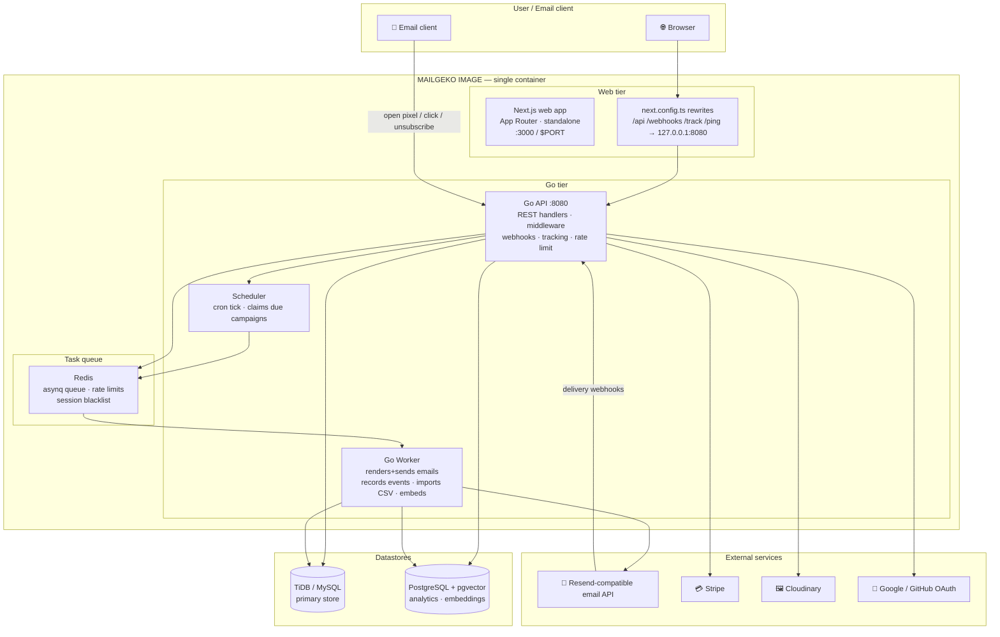

### The three processes

| Process | Entrypoint | What it does |
| --- | --- | --- |
| **API** | `backend/cmd/api` | HTTP server: REST API, webhook ingestion, signed tracking endpoints, and the campaign **scheduler** that moves due campaigns into the queue |
| **Worker** | `backend/cmd/worker` | Consumes asynq tasks: per-recipient render+send, event recording, CSV imports, embeddings |
| **Web** | Next.js standalone | UI on `:3000`; reverse-proxies `/api/*`, `/webhooks/*`, `/track/*`, `/ping` to the API |

Redis is **bundled inside the image** by default: `docker-entrypoint.sh` starts an
in-memory `redis-server` on `127.0.0.1:6379` when `REDIS_ADDR` is unset or points
at localhost. Set `REDIS_ADDR` to an external server (e.g. `rediss://…` Upstash)
to use a managed Redis instead.

Migrations auto-apply when the API boots, so a deploy is **migrate-and-go** —
no separate migration job.

---

## 4. Data model

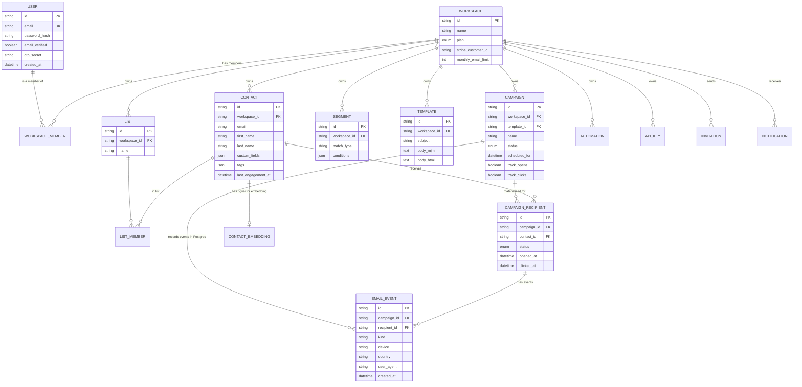

Key design decisions:

- **Multi-tenant.** Every user belongs to a *workspace*; most tables carry
  `workspace_id` and all queries are scoped by it.
- **Recipients are materialized.** Starting a campaign writes one
  `campaign_recipients` row per contact, so per-recipient state and stats are
  queryable without scanning raw events.
- **Events are append-only.** Raw email events stream into Postgres
  (`email_events`) and are rolled up into campaign stats counters.
- **Embeddings.** Contacts get pgvector embeddings for semantic search; the
  `static` embedding provider disables semantics but keeps everything local.

---

## 5. Core flows (how it works)

### 5.1 Account lifecycle

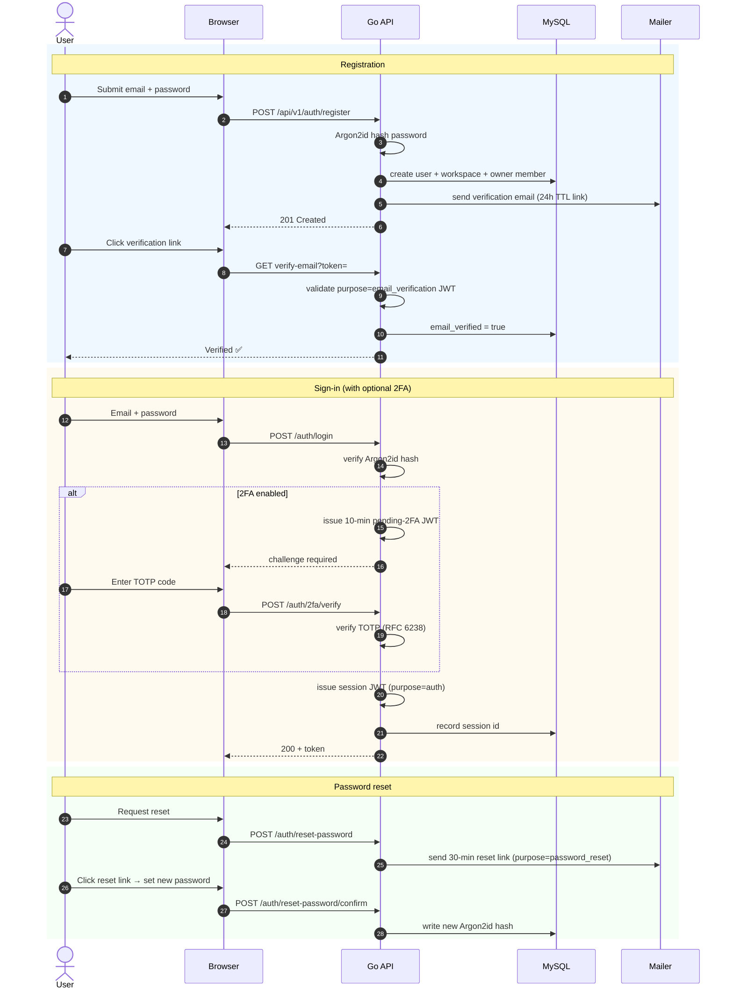

**JWT purposes.** Every token carries a `purpose` claim, so a verification link,
a reset link, a 2FA challenge and a real session can never be used
interchangeably:

| Purpose | TTL | Issued when |
| --- | --- | --- |
| `auth` (session) | `$JWT_TTL` (env) | Successful login / 2FA |
| `email_verification` | 24 h | Registration |
| `password_reset` | 30 min | Reset request |
| *pending 2FA* | 10 min | Login when 2FA enabled, before TOTP verified |

### 5.2 Authentication & security

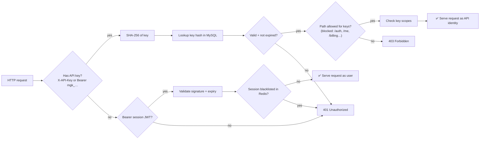

Every HTTP response also carries a strict security-header set (HSTS in prod,
`X-Frame-Options`, `X-Content-Type-Options`, `Referrer-Policy`,
`Permissions-Policy`, and a narrow CSP). See [§12 Security model](#12-security-model).

### 5.3 Contacts, lists & segments

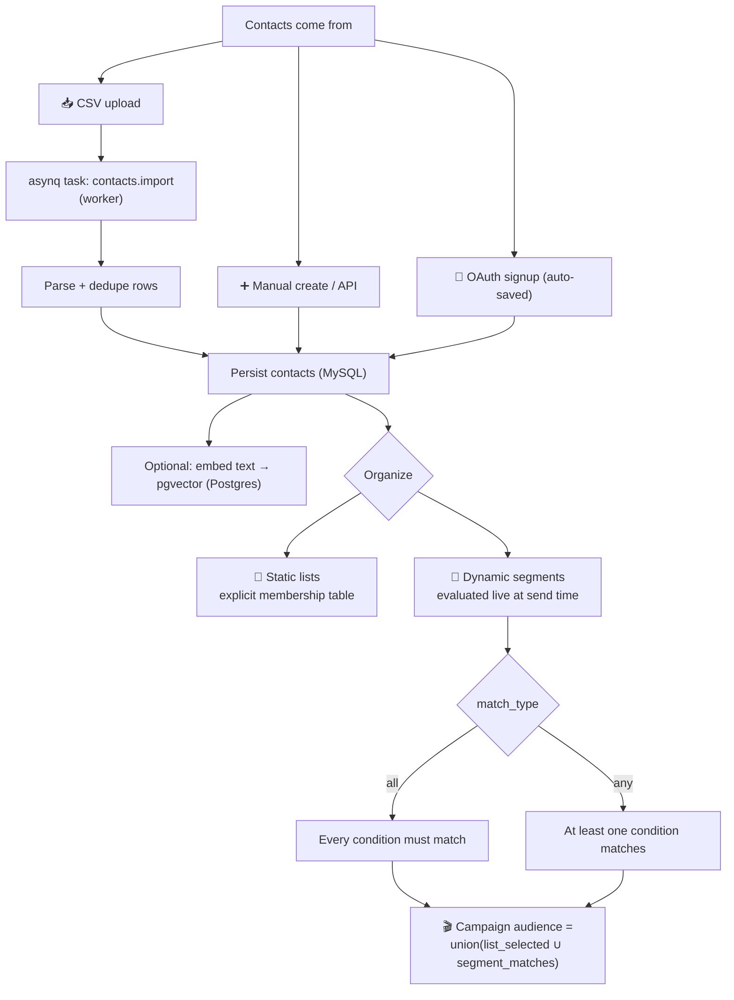

Condition fields: `status`, `email`, `first_name`, `last_name`, `company`,
`position`, `country`, `city`, `tags`, `last_engagement_at` (relative ages like
"30 days ago"), and any `custom.*` field — with operators *is / is not /
contains / does not contain / starts with / ends with / is before / is after*.

### 5.4 Campaign lifecycle

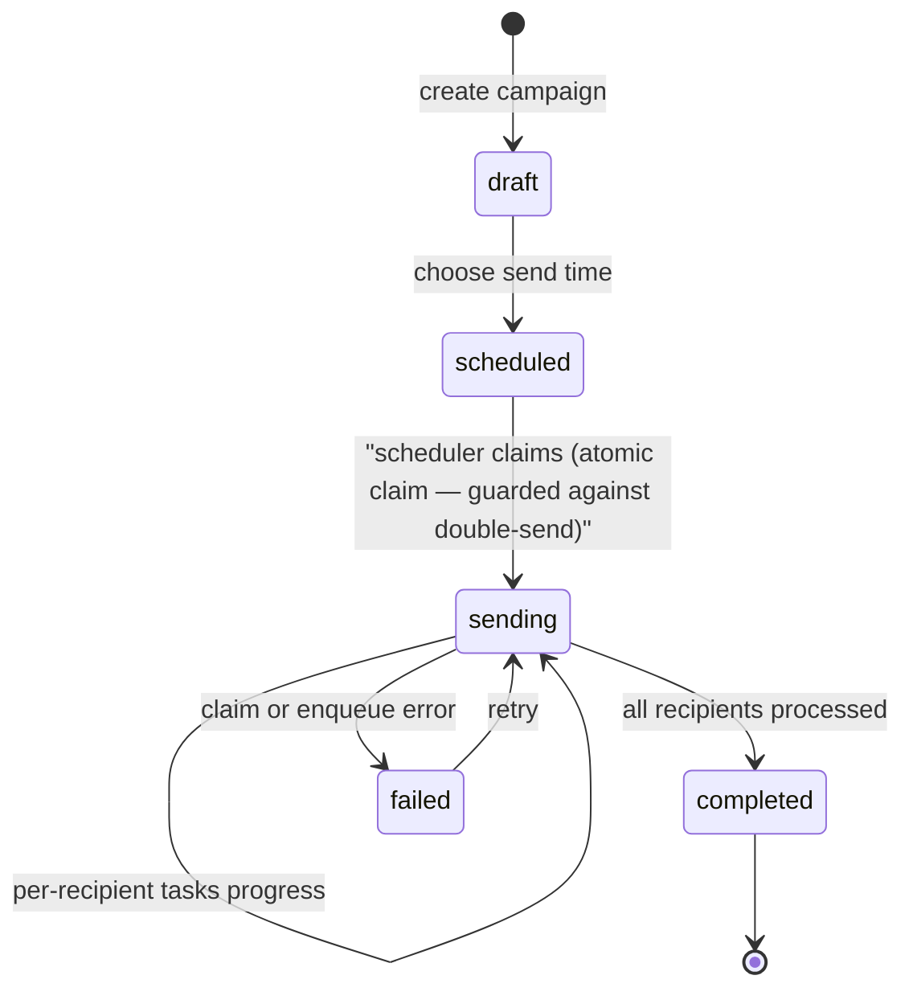

What happens at each stage:

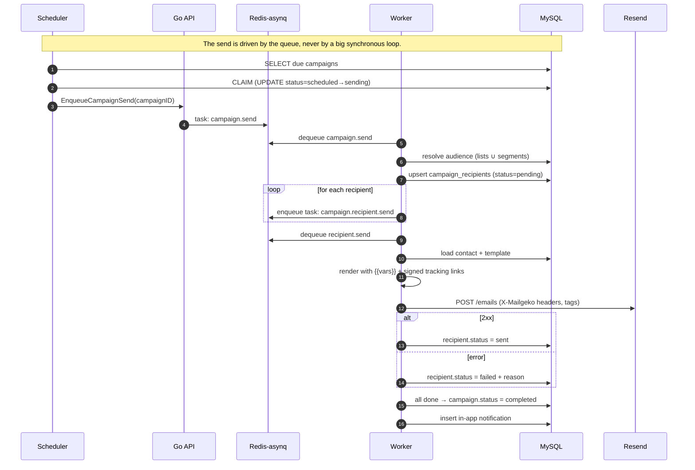

Because each recipient is an **independent queued task**, a 100k-contact campaign
degrades gracefully, retries cleanly, and partial failures are visible per
recipient rather than as one giant job.

### 5.5 Email rendering & tracking

Every email is rendered per-recipient in the worker. Variables are substituted
and every trackable element is signed with `TRACKING_SECRET` (HMAC) so links
cannot be forged or re-targeted.

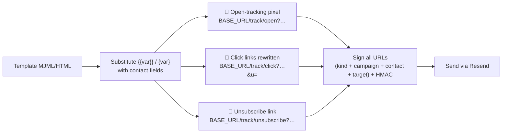

When the recipient's mail client loads the pixel or follows a link:

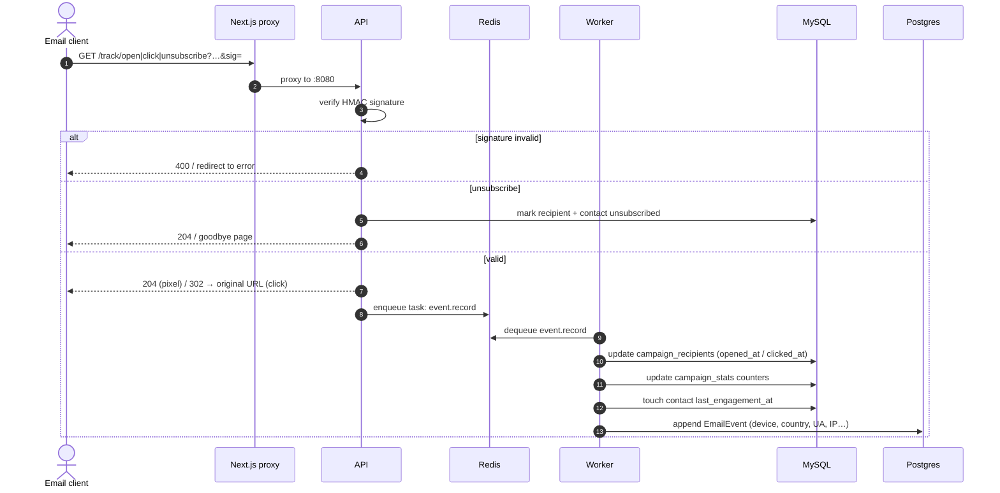

Only `http`/`https` targets are rewritten; anything else is dropped, and links
without a signature are rejected.

### 5.6 Delivery events & webhooks

Resend lifecycle events (`email.sent`, `delivered`, `opened`, `clicked`,
`bounced`, `complained`, `unsubscribed`) arrive at `/webhooks/resend`:

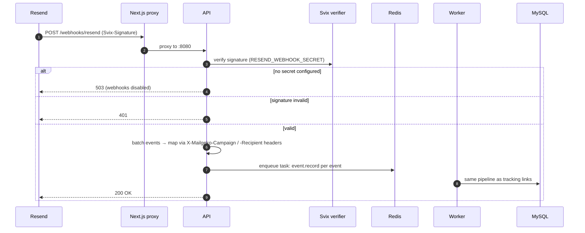

If `RESEND_WEBHOOK_SECRET` is not set, the endpoint returns `503` and webhooks
are simply not registered — open/click tracking still works via the pixel/links
in [§5.5](#55-email-rendering--tracking).

### 5.7 Analytics pipeline

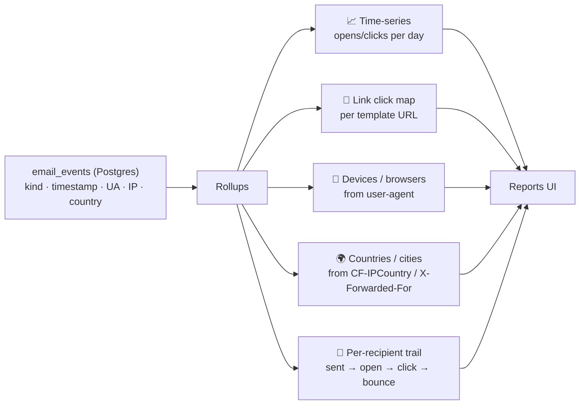

### 5.8 AI studio

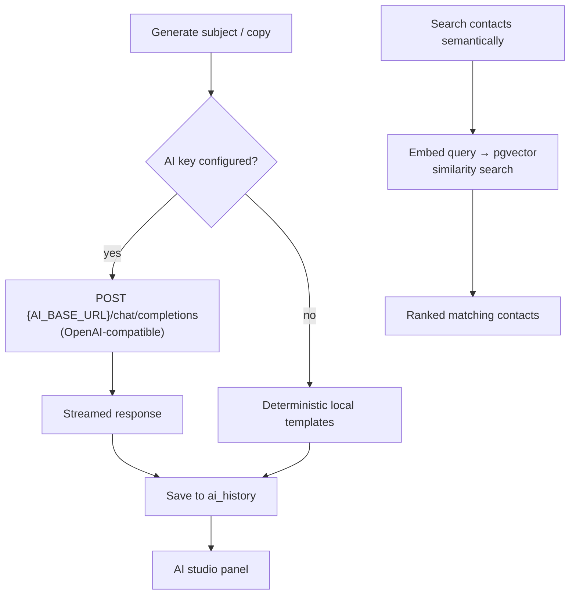

### 5.9 Billing & sending limits

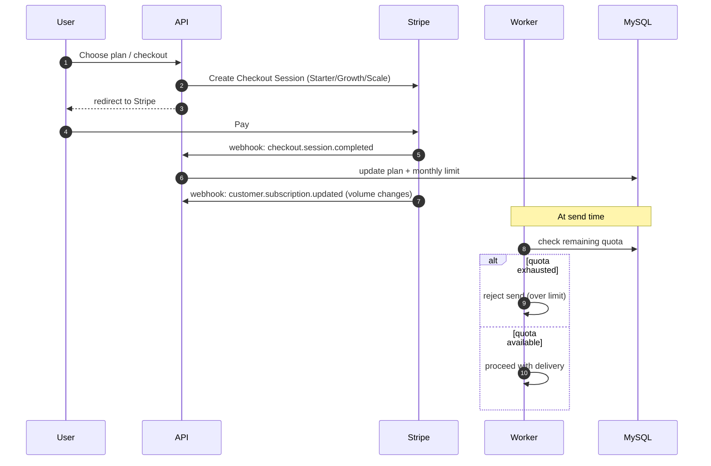

Without Stripe credentials, a built-in **local gateway** is used instead, so
self-hosters get the same plan/limit mechanics with zero external setup.

---

## 6. Technology stack

| Layer | Technology |
| --- | --- |
| Frontend | Next.js (App Router), React, TypeScript, Tailwind CSS, shadcn/ui, Recharts, MJML |
| API | Go 1.22+, chi router, `jmoiron/sqlx`, `golang-jwt/jwt/v5`, `hibiken/asynq` |
| Databases | TiDB/MySQL (primary), PostgreSQL + pgvector (analytics, embeddings) |
| Queue / cache | Redis (`go-redis/v9`), asynq task queue |
| Email | Resend-compatible REST client |
| Auth | Argon2id, purpose-scoped JWT, TOTP (`pquerna/otp`), OAuth 2.0 |
| Payments | Stripe SDK + webhooks, or built-in local gateway |
| AI | OpenAI-compatible chat completions; `openai` or `static` embeddings |
| Deploy | Docker multi-stage build, docker-compose, Render blueprint |

---

## 7. Repository layout

```
.
├── backend/                  # Go API + worker (module: …/mailgeko/backend)
│   ├── cmd/
│   │   ├── api/              # HTTP server + scheduler entrypoint
│   │   └── worker/           # async worker entrypoint
│   └── internal/
│       ├── ai/               # OpenAI-compatible chat/embedding clients
│       ├── analytics/        # event ingestion + report queries
│       ├── auth/             # passwords, JWT, TOTP, OAuth
│       ├── billing/          # Stripe + local gateway
│       ├── cloudinary/       # uploads
│       ├── config/           # env-based configuration
│       ├── database/         # connections + migrations (0001–0013)
│       ├── embed/            # embedding provider (openai | static)
│       ├── engine/           # render, tracking links, segments, import, send
│       ├── httpapi/          # handlers, middleware, webhooks, tracking
│       ├── oauth/            # Google / GitHub
│       ├── queue/            # asynq tasks (campaign, recipient, event, import)
│       ├── scheduler/        # due-campaign release loop
│       ├── sender/           # Resend-compatible client
│       ├── store/            # SQL queries over TiDB/MySQL
│       ├── svix/             # webhook signature verification
│       ├── track/            # signed link generation/verification
│       └── vector/           # pgvector queries
├── src/                      # Next.js app
│   ├── app/(app)/…           # dashboard, contacts, lists, campaigns, templates,
│   │                         #   automations, reports, ai, settings/*
│   ├── app/(auth)/…          # login, register, forgot/reset password, verify
│   └── app/api/preview/mjml/ # server-side MJML render for previews
├── next.config.ts            # standalone output + /api /webhooks /track rewrites
├── Dockerfile                # multi-stage build → one runtime image
├── docker-entrypoint.sh      # starts API + worker + web in one container
├── docker-compose.yml        # app service (bring-your-own datastores)
├── docker-compose.full.yml   # self-contained stack (MariaDB + Redis + Postgres)
├── render.yaml               # Render blueprint
└── .env.production.example   # documented production env reference
```

---

## 8. HTTP API reference

Everything under `/api/v1` is reverse-proxied from the web origin.

| Area | Sample routes |
| --- | --- |
| Auth | `POST /auth/register`, `/auth/login`, `/auth/logout`, `/auth/refresh`, `/auth/2fa/*`, `/auth/verify-email`, `/auth/reset-password`, OAuth callback |
| Workspace | `GET/PATCH /workspace`, `/workspace/members`, invitations |
| Contacts | `GET/POST /contacts`, `GET/PATCH/DELETE /contacts/:id`, `/contacts/import`, search |
| Lists / segments | `GET/POST /lists`, `/lists/:id/contacts`, `/segments` |
| Templates | `GET/POST/PATCH/DELETE /templates/:id` |
| Campaigns | `GET/POST /campaigns`, `GET/PATCH /campaigns/:id`, `/campaigns/:id/send`, `/campaigns/:id/stats` |
| Automations | `GET/POST/PATCH/DELETE /automations/:id` |
| Reports | `/reports/*` (overview, series, links, devices, countries) |
| AI | `/ai/*` |
| Billing | `/billing/*`, `/billing/webhook` |
| Notifications | `/notifications` |
| Tracking | `GET /track/open|click|unsubscribe?…` (signed, browser-facing) |
| Webhooks | `POST /webhooks/resend`, `POST /webhooks/stripe` |
| Ops | `GET /ping` |

**Auth:** `Authorization: Bearer <session JWT>` for interactive routes;
`X-API-Key: mgk_…` (or the Bearer form) for machine-to-machine routes.

---

## 9. Getting started

### Option A — one command (self-contained stack)

```bash
cp .env.example .env            # set JWT_SECRET (openssl rand -hex 32)
docker compose -f docker-compose.full.yml up --build
# open http://localhost:3000 — MariaDB, Redis and Postgres are bundled
```

### Option B — from source

Requirements: Go 1.22+, Node 20+, MySQL/MariaDB, Redis, PostgreSQL (pgvector
optional).

```bash
# 1. datastores (your local setup)
mariadbd & redis-server & postgres &

# 2. backend — schema auto-migrates on boot
cd backend
TIDB_DSN="mailgeko:mailgeko@tcp(127.0.0.1:3306)/mailgeko?parseTime=true&charset=utf8mb4" \
POSTGRES_DSN="postgres://postgres@127.0.0.1:5432/mailgeko?sslmode=disable" \
REDIS_ADDR="127.0.0.1:6379" JWT_SECRET="dev-secret" \
RESEND_API_KEYS="re_test" EMBED_PROVIDER=static \
go run ./cmd/api &              # :8080
go run ./cmd/worker &

# 3. frontend
cd ..
pnpm install
pnpm dev                        # :3000 → proxies /api, /webhooks, /track
```

Register an account at http://localhost:3000. For outbound mail, point
`RESEND_API_ENDPOINT` at a mock Resend-compatible server.

---

## 10. Environment variables

Full reference: `.env.production.example`.

| Variable | Required | Description |
| --- | --- | --- |
| `APP_ENV` | no | `development` / `production` (HSTS, logging) |
| `PORT` | no | Web port (default `3000`); API always binds `:8080` |
| `BASE_URL` | yes (prod) | Public origin; used in tracking/unsubscribe links |
| `ALLOWED_ORIGINS` | no | Comma-separated CORS allowlist; defaults to the `BASE_URL` origin (plus localhost in dev) |
| `JWT_SECRET` | yes | HS256 signing secret — **stable across restarts** |
| `TRACKING_SECRET` | yes (prod) | HMAC key for tracking/unsubscribe links |
| `TIDB_DSN` | yes | MySQL/TiDB DSN (auto-migrates at boot) |
| `POSTGRES_DSN` | yes | Postgres DSN for analytics + embeddings |
| `REDIS_ADDR` | no | Redis address (queue, rate limits, sessions). **Leave empty to use the bundled in-container Redis**; set to an external server (e.g. `rediss://…`) to use a managed one |
| `RESEND_API_KEYS` | yes | Comma-separated Resend keys (needed to boot) |
| `RESEND_API_ENDPOINT` | no | Defaults to Resend; point at a mock |
| `RESEND_WEBHOOK_SECRET` | no | Svix secret for `/webhooks/resend`; unset → webhooks disabled |
| `EMBED_PROVIDER` | no | `static` (default) or `openai` for pgvector search |
| `EMBED_BASE_URL` / `EMBED_MODEL` / `EMBED_DIMENSIONS` | no | Embedding endpoint config |
| `OPENAI_API_KEY` / `AI_BASE_URL` / `AI_MODEL` | no | AI studio chat completions |
| `STRIPE_SECRET_KEY` / `STRIPE_WEBHOOK_SECRET` / `STRIPE_PRICE_*` | no | Stripe billing; absent → local gateway |
| `CLOUDINARY_*` | no | Asset uploads |
| `GOOGLE_CLIENT_ID/SECRET` / `GITHUB_CLIENT_ID/SECRET` | no | OAuth sign-in |

---

## 11. Deployment

### Docker

```bash
# self-contained (bundled MariaDB + Redis + Postgres)
docker compose -f docker-compose.full.yml up --build

# or bring your own datastores
cp .env.example .env && docker compose up --build
```

### Render

A `render.yaml` blueprint is included. **New → Blueprint** → select the repo →
fill the `sync: false` secrets (`BASE_URL`, `JWT_SECRET`, `TRACKING_SECRET`,
`TIDB_DSN`, `POSTGRES_DSN`, `REDIS_ADDR`, `RESEND_API_KEYS`). Migrations run on
boot; health check is `/ping`.

Production notes:

- Set `BASE_URL` to your public origin so tracking/unsubscribe links and
  webhook callbacks resolve to the right host.
- Set `RESEND_WEBHOOK_SECRET` to enable delivery webhooks (bounces/complaints)
  in addition to pixel tracking.
- `RESEND_API_KEYS` is required to start — use a real key in production.
- Sending is gated by billing; the local gateway is used until Stripe
  credentials are supplied.

---

## 12. Security model

```mermaid
flowchart LR
    subgraph H["Defense in depth"]
        A["🔑 Argon2id passwords<br/>+ unique salts"]
        B["🎟 Purpose-scoped JWTs<br/>+ Redis token blacklist"]
        C["🧮 TOTP 2FA<br/>+ hashed recovery codes"]
        D["🔐 API keys: SHA-256 only<br/>mgk_ prefix · scopes · route blocking"]
        E["✍️ HMAC-signed tracking<br/>+ Svix-signed webhooks"]
        F["🛡 Strict security headers<br/>CSP · HSTS · frame/type/ref/policy"]
        G["⏱ Rate limiting 300/min<br/>per IP+path (Redis)"]
        H["📦 Webhook body limits<br/>+ CORS allow-list"]
    end
```

- **Passwords.** Argon2id (`golang.org/x/crypto`), unique salt per hash,
  constant-time verification.
- **Tokens.** HS256 JWTs with a `purpose` claim; session tokens revocable by
  blacklisting the token id in Redis.
- **2FA.** TOTP (RFC 6238); recovery codes stored hashed; sign-in gated by a
  10-minute pending token.
- **API keys.** Only the SHA-256 digest is stored; keys start with `mgk_`, carry
  scopes, and are blocked from user-account endpoints.
- **Email link integrity.** Tracking/unsubscribe links and delivery webhooks are
  HMAC-signed; webhooks additionally verified with Svix signatures.
- **Transport & headers.** HSTS (production) plus `X-Frame-Options`,
  `X-Content-Type-Options`, `Referrer-Policy`, `Permissions-Policy` and a strict
  CSP on both the Next.js app and every API response.
- **Rate limiting.** Fixed window (default 300/min) per IP+path in Redis, `429`
  on overflow.

---

## 13. Testing

```bash
cd backend && go test -timeout 120s ./...
bash /tmp/opencode/run/smoke.sh     # end-to-end API smoke suite (57 checks)
pnpm lint && npx tsc --noEmit        # frontend static checks
```

---

## 14. Known limitations & roadmap

- **Automation execution** is scaffolded (visual builder + stored workflows) but
  not yet wired to the worker — scheduled sends are the supported path today.
- **Segment conditions on opens/clicks** are stored but evaluate to `false`;
  use the *last engagement* condition instead.
- **Webhooks** are enabled only when `RESEND_WEBHOOK_SECRET` is set; no polling
  fallback yet.
- **Billing** gates volume via Stripe; the built-in local gateway is the default
  for self-hosters.
- **Vector search** needs an embedding provider (`EMBED_PROVIDER=openai`); the
  `static` provider keeps search deterministic but non-semantic.

---

## 15. License

Proprietary / all rights reserved.
